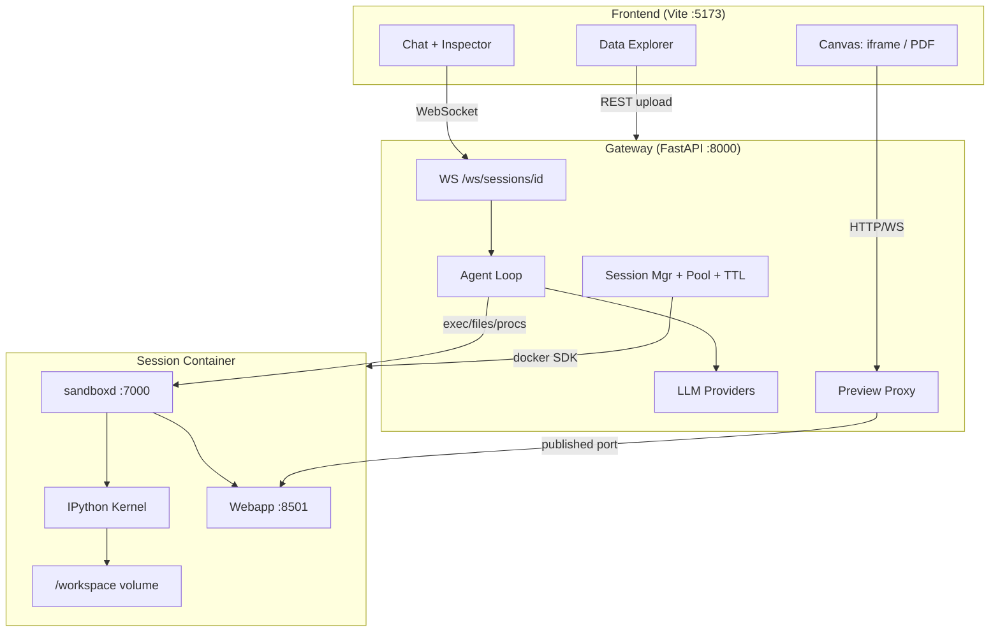
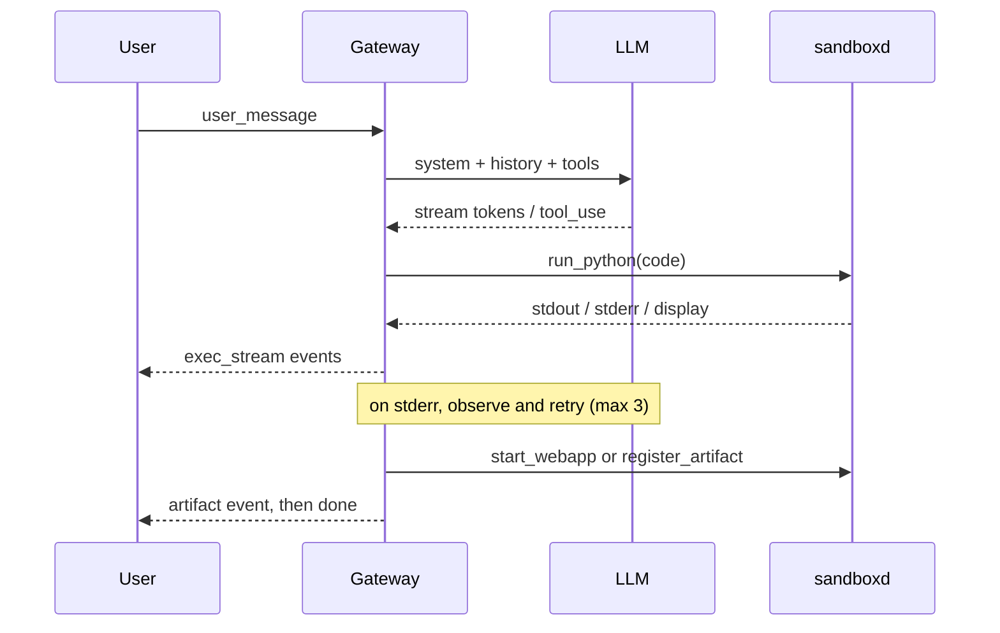

## Data Copilot POC

Container-native agent workbench per PRD.txt. Decisions locked: provider-agnostic LLM layer (Anthropic + OpenAI + offline mock), Docker per-session sandboxes, Vite + React + TS + Tailwind + shadcn frontend, core loop only (workflows/scheduling deferred).

### Prerequisite
Docker Desktop's engine must be running (socket exists, daemon currently unreachable). Step 1 is a preflight that fails loudly with remediation text rather than degrading to a local sandbox. I'll verify before building the image; if it's still down I'll stop and tell you instead of working around it.

### Architecture



### Agent turn



### Repo layout
```
sandbox/Dockerfile + sandbox/sandboxd/   in-container control service
backend/app/{api,agent,sandbox,sessions,profiling}
frontend/src/{components,lib,store}
scripts/smoke.py + sample data
sessions/                                trajectories + artifact cache (gitignored)
README.md .env.example Makefile .gitignore
```

### Build steps

**1. Scaffold + preflight.** `git init`, `.gitignore`, `.env.example`, `Makefile`. Docker daemon health check.

**2. Sandbox image** (`sandbox/Dockerfile`, python:3.11-slim):
- apt: libpango/libcairo/gdk-pixbuf/shared-mime-info + DejaVu fonts (WeasyPrint)
- pip per PRD §4.3: pandas, polars, numpy, scipy, pyarrow, openpyxl, xlrd; streamlit, dash, nicegui, fastapi, uvicorn, bottle; typst, weasyprint, reportlab, matplotlib, seaborn, plotly, kaleido; ipykernel, jupyter_client
- `sandboxd`: FastAPI service owning a `jupyter_client` KernelManager. Endpoints: `/health`, `/exec` (SSE-streamed stdout/stderr/display), `/vars`, `/files/{upload,download,list}`, `/procs/{start,stop,list}`, `/artifacts`
- Image is a few GB; build takes several minutes, done once

**3. Session manager + Docker provider.** `Sandbox` protocol with `DockerSandbox` impl:
- named volume `dc-{sid}` at `/workspace`, published ports 7000 (sandboxd) + 8501/8502/8000/8080 (apps) → ephemeral host ports
- guardrails per §5: `nano_cpus=2e9`, `mem_limit=4g`, `pids_limit`, `cap_drop=ALL`, `no-new-privileges`, tmpfs `/tmp`
- egress blocked via dedicated bridge network with `enable_ip_masquerade=false` (LLM calls happen in the gateway, never the container); `SANDBOX_ALLOW_EGRESS` flag for debugging
- warm pool of pre-booted containers for the <3s start target; 30-min idle reaper removes container + volume

**4. Ingestion + auto-profiling** (§4.2). Upload streams through the gateway into `/workspace/data`, then a bootstrap exec loads CSV/XLSX/XLS/Parquet/JSON into `df_1..df_n` and returns dtypes, null %, describe(), head sample, row/col counts. Summaries are injected into the system prompt and broadcast to the Data Explorer.

**5. Agent harness** (§4.3). `LLMProvider` protocol with streaming tool-calls; Anthropic + OpenAI adapters + a deterministic mock that drives real dashboard and PDF trajectories with no key. Tools: `run_python`, `write_file`, `read_file`, `list_files`, `start_webapp`, `stop_webapp`, `register_artifact`. Self-correction feeds stderr back, 3 retries per turn. Every event appended to `sessions/{sid}/trajectory.jsonl`.

**6. Preview proxy** (§4.4A). `/session/{sid}/preview/{port}/{path}` reverse-proxies HTTP and WebSocket (Streamlit's `_stcore/stream`) to the mapped host port. Streamlit launches with `--server.baseUrlPath` so its own asset URLs resolve under the sub-path.

**7. Artifacts** (§4.4B). PDF pulled from the container and streamed via `/api/sessions/{sid}/artifacts/{name}`; `artifact` WS event flips the canvas to Document mode.

**8. Frontend** (§4.1). Resizable split-pane (35/65) via `react-resizable-panels`, full-screen canvas toggle. Chat with token streaming and tool-call cards. Canvas dual-mode: sandboxed `iframe` (`allow-scripts allow-same-origin allow-forms`) and PDF viewer (`pdfjs-dist`) with zoom/search/export. Data Explorer sidebar showing schemas and `df_n` names. Collapsible Execution Inspector with live stdout/stderr, active variables, generated code. Zustand store, shadcn + Lucide.

### Validation
- `pytest` on session manager, profiler, tool dispatch, proxy path parsing
- `scripts/smoke.py` end-to-end against each PRD §7 criterion: profile-under-2s, dashboard embedded and HTTP 200 within 30s, multi-page PDF with charts and no unhandled errors, container isolation asserted (no host FS access, egress blocked)
- `tsc --noEmit` + `vite build`
- README with setup, `.env` keys, and a demo script

Backend and frontend tracks run in parallel via subagents once the sandbox image and session API contract are settled.
