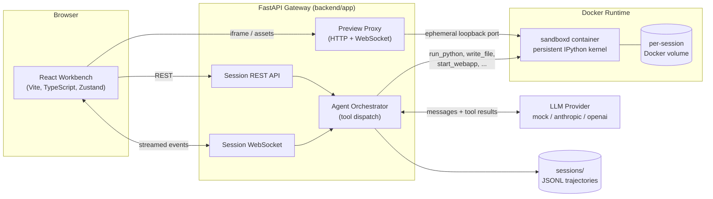
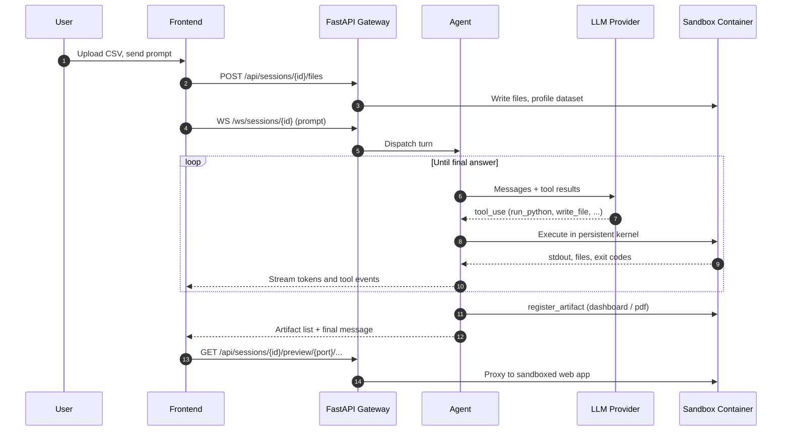
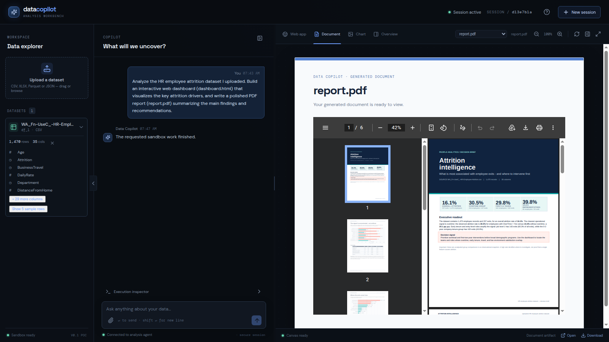

# Data Copilot

A container-native analytics copilot built from [`PRD.txt`](PRD.txt). Data
Copilot lets a user upload datasets, converse with an agent that writes and
executes Python against them, and receive interactive dashboards and PDF
reports as downloadable artifacts, all inside isolated per-session Docker
sandboxes.


## Features

- **Dataset upload and profiling** with automatic schema, statistics, and
  preview generation.
- **Persistent execution sandbox**: each session runs a dedicated Docker
  container hosting a stateful IPython kernel, filesystem, and process
  manager (`sandboxd`).
- **Pluggable agent backends**: a deterministic offline `mock` provider for
  development and CI, plus Anthropic and OpenAI adapters.
- **Artifact pipeline**: dashboards (Streamlit) and PDF reports are produced
  inside the sandbox, registered as artifacts, and served through the
  gateway.
- **Preview proxying**: HTTP and WebSocket reverse proxy into sandboxed web
  apps over ephemeral loopback ports.
- **React workbench**: file explorer, chat, canvas tabs, and an execution
  inspector with full tool-call trajectories.

## Architecture



### Agent loop



### Components

| Component | Path | Responsibility |
| --- | --- | --- |
| Gateway | `backend/app` | FastAPI app: session lifecycle, upload/profiling, provider adapters, agent tool dispatch, preview proxy |
| Sandbox image | `sandbox/` | Docker image and `sandboxd` service (IPython kernel, file and process APIs) |
| Frontend | `frontend/` | Vite + React + TypeScript + Zustand workbench |
| Trajectory logs | `sessions/` | Local JSONL logs and fake-sandbox workspaces used by tests |
| Smoke test | `scripts/smoke.py` | End-to-end validation against the real Docker backend |

## Quick start

Requirements:

- Python 3.11+
- Node.js 20+
- Docker Desktop or another reachable Docker daemon

Install dependencies and build the sandbox image:

```bash
uv sync
cd frontend && npm install && cd ..
cp .env.example .env
docker build -t data-copilot-sandbox:latest sandbox
```

Start the gateway and the UI in separate terminals:

```bash
uv run uvicorn app.main:app --app-dir backend --host 127.0.0.1 --port 8000
cd frontend && npm run dev
```

Open `http://localhost:5173`. The Vite dev server proxies `/api` and `/ws` to
the gateway on port 8000, so no `VITE_API_URL` configuration is needed and
artifact downloads stay same-origin. The default `LLM_PROVIDER=mock` mode is
deterministic and requires no API key. Set `LLM_PROVIDER=anthropic` or
`openai` and provide the corresponding key to use a live provider.

Equivalent `make` targets are available: `make install`, `make backend`,
`make frontend`, `make build-sandbox`, `make smoke`.

## Demo

The screenshots in this README come from a single prompt against the sample
HR attrition dataset:

1. Upload `sample_data/WA_Fn-UseC_-HR-Employee-Attrition.csv` from the left
   explorer.
2. Ask: **"Analyze the dataset, build an interactive web dashboard of the key
   attrition drivers, and write a polished PDF report."**
3. The agent profiles the data, runs Python in the session sandbox, and
   publishes both artifacts to the canvas: `dashboard.html`, a live web app
   proxied from the container (the hero image above), and `report.pdf`, a
   six-page decision brief rendered in the document tab:



4. Reopen or download any artifact from the canvas selector; a browser
   refresh restores the chat, datasets, and artifacts from the session
   trajectory.

The live smoke test covers the same flow against the real Docker backend:

```bash
uv run python scripts/smoke.py
```

## Configuration

All settings are environment-backed (see `backend/app/config.py`) and can be
placed in `.env`:

| Variable | Default | Description |
| --- | --- | --- |
| `LLM_PROVIDER` | `mock` | Agent backend: `mock`, `anthropic`, or `openai` |
| `ANTHROPIC_API_KEY` / `OPENAI_API_KEY` | empty | Provider credentials |
| `ANTHROPIC_MODEL` | `claude-sonnet-5` | Anthropic model identifier |
| `OPENAI_MODEL` | `gpt-5.6` | OpenAI model identifier |
| `BACKEND_HOST` / `BACKEND_PORT` | `0.0.0.0` / `8000` | Gateway bind address |
| `FRONTEND_ORIGIN` | `http://localhost:5173,...` | Comma-separated CORS origins |
| `SESSION_TTL_MINUTES` | `30` | Idle session lifetime before reaping |
| `SESSION_VOLUME_PREFIX` | `dc` | Prefix for per-session Docker volumes |
| `SANDBOX_IMAGE` | `data-copilot-sandbox:latest` | Image used for session containers |
| `SANDBOX_NETWORK` | `data-copilot-sandbox` | Dedicated bridge network for sandboxes |
| `SANDBOX_ALLOW_EGRESS` | `false` | Allow outbound network access from sandboxes |
| `DOCKER_SOCKET` | `unix:///var/run/docker.sock` | Docker daemon socket |
| `SESSIONS_DIR` | `sessions` | Trajectory log directory |

## API surface

| Method | Path | Purpose |
| --- | --- | --- |
| `GET` | `/health` | Liveness probe |
| `POST` | `/api/sessions` | Create a session and its sandbox |
| `GET` | `/api/sessions/{session_id}` | Session state, files, and artifacts |
| `POST` | `/api/sessions/{session_id}/files` | Upload and profile datasets |
| `GET` | `/api/sessions/{session_id}/artifacts/{name}` | Download a registered artifact |
| `DELETE` | `/api/sessions/{session_id}` | Tear down container and volume |
| `ANY` | `/api/sessions/{session_id}/preview/{port}/{path}` | HTTP preview proxy into the sandbox |
| `WS` | `/api/sessions/{session_id}/preview/{port}/{path}` | WebSocket preview proxy |
| `WS` | `/ws/sessions/{session_id}` | Agent event stream (tokens, tool calls, artifacts) |

## Agent tools

The agent orchestrator exposes a fixed tool set to the provider:

| Tool | Description |
| --- | --- |
| `run_python` | Execute Python in the session's persistent IPython kernel |
| `write_file` / `read_file` | File I/O inside the sandbox workspace |
| `list_files` | Enumerate workspace files |
| `start_webapp` / `stop_webapp` | Manage sandboxed web apps (dashboards) on registered ports |
| `register_artifact` | Publish a generated file (dashboard, PDF) to the client |

## Sandbox isolation

Each session receives its own container and volume with:

- CPU, memory, and PID limits
- Dropped Linux capabilities and `no-new-privileges`
- A restricted, per-container `/tmp`
- A dedicated bridge network with IP masquerading disabled
- Only ephemeral loopback ports published, bound for the local gateway

Outbound egress is denied by default. Set `SANDBOX_ALLOW_EGRESS=true` only
when sandboxed code explicitly requires network access.

## Validation

```bash
uv run pytest -q
cd frontend && npm run typecheck && npm run build
docker build -t data-copilot-sandbox:latest sandbox
```

Backend tests run against `FakeSandbox` and require no Docker daemon. The
smoke test exercises the real Docker-backed session: upload and profiling,
dashboard preview, PDF download, and cleanup.
